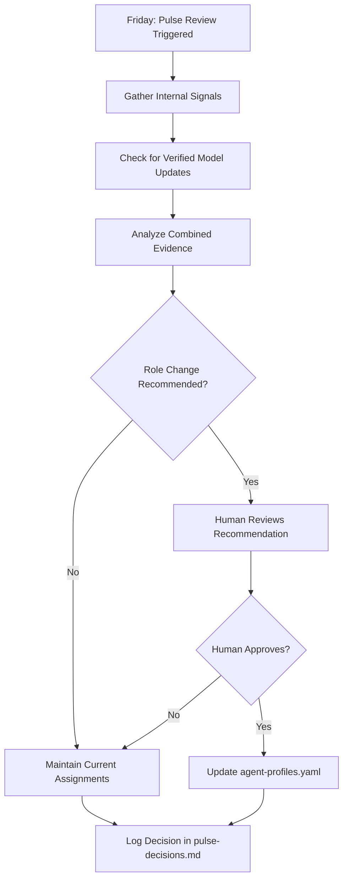

# Agent Capability Pulse

> **Intent (Dev Notes):**  
> This document defines the weekly Agent Capability Pulse system — a hybrid approach combining internal performance signals with verified model updates to dynamically assign agent roles.  
> The goal is to ensure the right agent handles the right task while maintaining human oversight.

---

## Overview

The Agent Capability Pulse is a **weekly assessment** that evaluates each AI agent's fitness for specific roles (Builder, Final Auditor, etc.) based on:

1. **Internal signals** — Performance metrics from actual work in this repository
2. **Verified external updates** — Confirmed model releases and capability changes

This is NOT a trust exercise. It's an evidence-based role assignment system.

---

## Weekly Pulse Cycle



---

## Internal Performance Signals

Tracked per agent, per role:

| Signal | Description | Source |
|--------|-------------|--------|
| **Task Completion Rate** | % of assigned tasks completed successfully | PR history |
| **Audit Accuracy** | Verdicts that held up post-merge | Audit logs |
| **Iteration Count** | Avg revisions before approval | PR comments |
| **Error Introduction** | Bugs/issues traced to agent's work | Issue tracker |
| **Documentation Quality** | Completeness of dev notes, intents | Code review |

---

## External Update Verification

**Rule: Unverified claims do NOT change roles.**

Valid sources for model updates:
- Official release notes (OpenAI, Anthropic, etc.)
- Published changelogs with version numbers
- Announced capability changes

Invalid sources:
- Self-reported claims from agents
- Rumors or speculation
- Benchmark comparisons without context

---

## Advisory Period

**New roles start in advisory mode.**

- **Duration:** 5 cycles (5 weeks) per role per agent
- **During advisory:** Recommendations only, human makes final call
- **After advisory:** Auto-assignment may be enabled (human opt-in)

```yaml
# Example from agent-profiles.yaml
advisory_cycles_completed:
  Builder: 3        # Still in advisory (needs 5)
  Final_Auditor: 7  # Past advisory, auto-assign eligible
```

---

## Role Assignment Rules

### 1. Independence Rule
The agent that builds a change **cannot** be the final approver.

### 2. Regression Handling
If an agent shows performance regression:
- Role reverts to **advisory mode**
- Advisory counter resets to 0
- Requires 5 new clean cycles before auto-assignment

### 3. New Agent Onboarding
New agents (e.g., Cursor, Gemini) start with:
- All roles in advisory mode
- `advisory_cycles_completed: 0` for all roles
- `auto_assign_enabled: false`

---

## Confidence Scoring

Each agent has a confidence score (0-100) per role:

| Range | Meaning |
|-------|---------|
| 0-30 | Low confidence, advisory only |
| 31-60 | Moderate, human review recommended |
| 61-80 | High, auto-assign eligible |
| 81-100 | Proven, priority assignment |

Confidence is updated weekly based on internal signals.

---

## Weekly Pulse Checklist

- [ ] Review internal performance signals since last pulse
- [ ] Check for verified model updates
- [ ] Analyze combined evidence
- [ ] Generate role recommendations
- [ ] Log recommendations in `agents/pulse-decisions.md`
- [ ] If changes recommended, human approves/rejects
- [ ] Update `agents/agent-profiles.yaml` if approved
- [ ] Commit changes to repository

---

## Related Files

- `agents/agent-profiles.yaml` — Current role assignments and metrics
- `agents/pulse-decisions.md` — Weekly decision log
- `workflows/07-agent-pulse-review.md` — Step-by-step workflow
- `PROMPTS/agent-pulse-audit.md` — Analysis prompt template

---

*Last updated: Governed by AI_CONTRACT.md*
