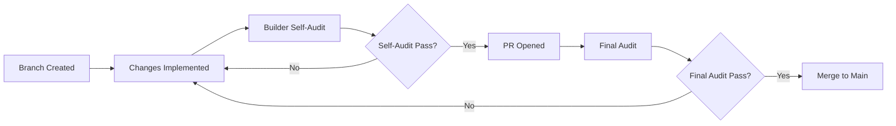

# Branching and Pull Request Protocol

> **Intent (Dev Notes):**  
> This document establishes the branching strategy and PR workflow for Solo Stack Method™.  
> GitHub is the execution environment — main represents production, and all changes flow through branches and PRs with mandatory audits.

---

## Core Rules

### 1. Main = Production

The `main` branch is always deployable. It represents the current production state of the system.

**Never commit directly to main.**

### 2. All Work Happens on Branches

Every change — code, docs, prompts, workflows — must be made on a feature or chore branch.

### 3. PRs Are Mandatory

All branches must land via Pull Request. No exceptions.

---

## Branch Naming Conventions

| Type | Pattern | Example |
|------|---------|---------|
| Feature | `feat/<description>` | `feat/stack-pulse-edge-function` |
| Fix | `fix/<description>` | `fix/dedupe-key-collision` |
| Documentation | `docs/<description>` | `docs/api-reference` |
| Chore/Maintenance | `chore/<description>` | `chore/dual-audit-pulse-system` |
| Refactor | `refactor/<description>` | `refactor/pulse-update-logic` |

Use lowercase with hyphens. Keep names short but descriptive.

---

## Pull Request Requirements

### For All PRs

1. **Clear title** following commit message conventions
2. **Description** explaining what and why
3. **Link to related issues/docs** if applicable

### For Non-Trivial Changes (Code, Schema, Config)

1. **Acceptance Criteria** checklist
2. **Audit Packet** (generated via `PROMPTS/generate-audit-packet.md`)
3. **Builder Self-Audit Verdict** (Approve / Changes Requested / Block)
4. **Final Audit Verdict** (Approve / Changes Requested / Block)
5. **CI must pass**

### Trivial Changes (Typos, README updates)

May skip formal audit but still require PR and review.

---

## Dual Audit Requirement

**Critical Rule:** The agent that builds a change may NOT be the final approver.

- Default Builder: Claude
- Default Final Auditor: ChatGPT

See `agents/agent-profiles.yaml` for current role assignments.

---

## CI Requirements

All PRs must pass CI checks before merge:

- Lint/format validation (when applicable)
- Workflow/prompt validation (structure checks)
- No secrets in commits

---

## Rollback Guidance

If a merged change causes issues:

1. **Identify the problem commit** via `git log`
2. **Create a revert branch:** `git checkout -b revert/<original-branch>`
3. **Revert the commit:** `git revert <commit-hash>`
4. **Open a PR** with explanation of the issue
5. **Fast-track audit** (Builder + Final Auditor acknowledge the revert)
6. **Merge immediately** if production is impacted

---

## Emergency Procedures

For critical production issues requiring immediate fix:

1. Create branch: `hotfix/<description>`
2. Implement minimal fix
3. Both Builder and Final Auditor review synchronously
4. Merge with expedited approval
5. Document in `logs/prompt-evolution.md` with `[HOTFIX]` tag

---

*Last updated: Governed by AI_CONTRACT.md*
