# Workflow 07: Agent Capability Pulse Review

> **Intent (Dev Notes):**  
> This workflow defines the weekly process for evaluating agent capabilities and updating role assignments.  
> It enforces evidence-based decisions and prevents unverified claims from affecting roles.

---

## When to Run

- **Scheduled:** Every Friday (automated reminder via GitHub Actions)
- **Manual:** When significant model updates are announced
- **Emergency:** After a major agent failure in production

---

## Process Diagram

```mermaid
flowchart TD
    subgraph "Weekly Pulse Review"
        A[🗓️ Friday Trigger] --> B[📊 Gather Internal Signals]
        B --> C[🔍 Check External Updates]
        C --> D[📋 Run agent-pulse-audit.md Prompt]
        D --> E[📝 Document in pulse-decisions.md]
        E --> F{Role Changes?}
        F -- No --> G[✅ Log: No Changes]
        F -- Yes --> H[🧑 Human Review]
        H --> I{Approved?}
        I -- No --> J[📝 Log: Rejected + Reason]
        I -- Yes --> K[📄 Update agent-profiles.yaml]
        K --> L[💾 Commit Changes]
        L --> M[✅ Log: Changes Applied]
        G --> N[🔁 Wait for Next Week]
        J --> N
        M --> N
    end
```



---

## Step-by-Step Process

### Step 1: Gather Internal Signals

Review the past week's activity:

1. **PR History** — List all PRs merged since last pulse
2. **Audit Outcomes** — Did Builder/Auditor verdicts hold up?
3. **Issues** — Any bugs traced to specific agent's work?
4. **Revisions** — How many cycles before approval?

**Evidence Required:**
- PR links and merge dates
- Audit verdicts from PR comments
- Issue links if applicable

### Step 2: Check for Verified External Updates

Search for official announcements:

1. Check official blogs/release notes:
   - OpenAI: https://openai.com/blog
   - Anthropic: https://www.anthropic.com/news
   
2. Verify claims:
   - Must have version number
   - Must be from official source
   - Must describe capability changes

**Critical Rule:**  
```
⚠️ UNVERIFIED CLAIMS DO NOT CHANGE ROLES
```

An agent saying "I can do X now" is NOT sufficient. Only official documentation counts.

### Step 3: Run Analysis Prompt

Use `PROMPTS/agent-pulse-audit.md` to analyze combined evidence.

Input:
- Internal signals from Step 1
- Verified updates from Step 2
- Current agent-profiles.yaml

Output:
- Per-agent, per-role assessment
- Confidence score updates
- Role change recommendations

### Step 4: Document Findings

Create entry in `agents/pulse-decisions.md`:

```markdown
## Week of [DATE]

### Internal Signals
- Claude: [summary of performance]
- ChatGPT: [summary of performance]

### External Updates
- [List verified updates or "None"]

### Recommendations
- [Role changes or "No changes recommended"]

### Human Decision
- [ ] Approved
- [ ] Rejected (Reason: ___)

### Applied Changes
- [List changes or "None"]
```

### Step 5: Human Review (If Changes Recommended)

If any role changes are recommended:

1. Human reviews the evidence
2. Human approves or rejects with documented reason
3. Decision is final

**No auto-assignment without human opt-in.**

### Step 6: Apply Changes

If approved:

1. Update `agents/agent-profiles.yaml`
2. Commit with message: `chore: weekly pulse update - [DATE]`
3. Push to main (pulse updates bypass normal PR for efficiency)

---

## Advisory Mode Rules

For agents in advisory mode:

```
advisory_cycles_completed < advisory_cycles_required_for_auto (default: 5)
```

- **All recommendations are advisory only**
- Human must explicitly approve each task assignment
- Advisory counter increments only on successful completions
- Counter resets to 0 on any regression

---

## Edge Cases

### Model Degradation Detected
If internal signals show declining performance:
1. Immediately revert role to advisory
2. Reset advisory counter to 0
3. Document reason in pulse-decisions.md

### New Model Version Released
If a verified major update is released:
1. Do NOT automatically assume improvement
2. Start fresh advisory period if capabilities changed significantly
3. Let performance prove the update's value

### Agent Unavailable
If an agent becomes unavailable:
1. Reassign roles to remaining agents
2. All reassignments start in advisory mode
3. Document in pulse-decisions.md

---

## Automation (GitHub Actions)

The workflow `.github/workflows/agent-pulse-weekly.yml` triggers a reminder every Friday.

**Note:** The workflow only sends a reminder. It does NOT:
- Scrape external sites
- Make automated role changes
- Bypass human review

---

## Related Files

- `docs/agent-capability-pulse.md` — Full documentation
- `agents/agent-profiles.yaml` — Current assignments
- `agents/pulse-decisions.md` — Decision log
- `PROMPTS/agent-pulse-audit.md` — Analysis prompt

---

*Last updated: Governed by AI_CONTRACT.md*
